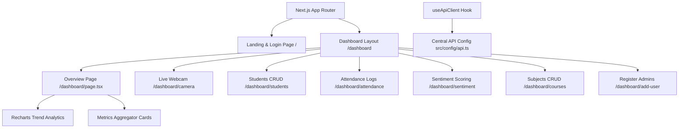
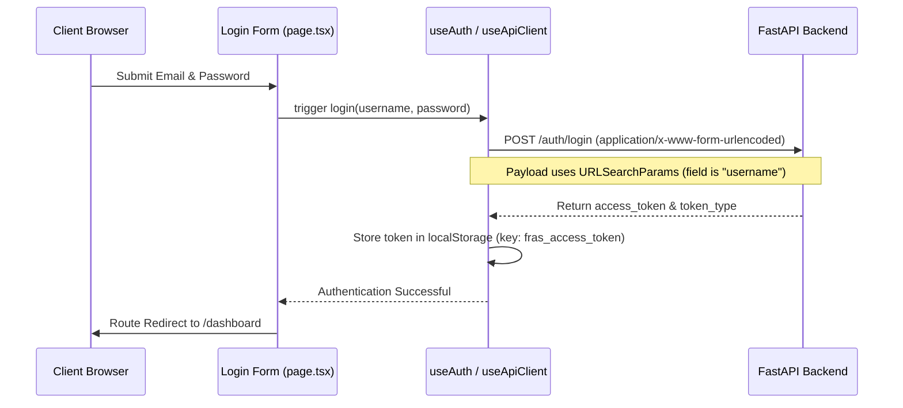

# Face Recognition Attendance System - Frontend Client

The frontend client is a premium, highly responsive administration panel built using **Next.js (App Router)** and **React 19**. It features visual analytics, dynamic attendance control grids, class enrollment interfaces, and a live webcam stream integrating with the backend over WebSockets.

---

## 1. Project Architecture & Component Structure

The client is designed using modular layouts, centralized API managers, and state hooks.



### 1.1 Technical Stack Details
- **Next.js 16 (App Router)**: Modern React framework supporting server side utilities, client component hydration, routing, and prefetching.
- **Framer Motion**: Powering smooth micro-animations, transitions, and landing page interactive reveals.
- **Recharts**: Rendering responsive area charts for attendance patterns.
- **Lucide React**: Vector icon pack for UI controls.
- **jsPDF & jsPDF-AutoTable**: Enabling client-side PDF document generation.
- **SheetJS (xlsx)**: Powering Excel spreadsheet downloads.
- **Tailwind CSS 4 + PostCSS**: CSS styling architecture.

### 1.2 Core Folders & Component Map
- `src/app`: Page router mapping and sub-route modules.
- `src/components/dashboard`: Shared dashboard layout elements (e.g. `Sidebar.tsx`, `MetricCard.tsx`, `Charts.tsx`).
- `src/config/api.ts`: **Central API Configuration** mapping all backend endpoints.
- `src/hooks`: Custom hooks managing operations:
  - `useAuth.ts`: Encapsulates login methods, token persistence, and logout cleanups.
  - `useApiClient.ts`: Unified API requester implementing JWT injection and session monitoring.
  - `useDashboardData.ts`: Coordinates server checks to update metrics cards and charts.
- `src/types/api.ts`: TypeScript interface definitions for API request/response payloads.

---

## 2. Complete User Authentication Flow & Login Mechanism

The frontend uses secure JWT credential storage and automated verification checks.



### 2.1 Storage & Token Persistence
- **Storage Hook**: Stored in the browser's `localStorage` under the key `fras_access_token`.
- **Global Availability**: Accessible across tabs via the `getStoredToken()` helper inside `src/hooks/useAuth.ts`.

### 2.2 API Interceptors & Authorization Headers
- **Unified Request wrapper**: The custom hook `useApiClient.ts` intercepts all API calls.
- **Token Injection**: If a token is found in storage, it automatically appends the following header to the HTTP fetch call:
  `Authorization: Bearer <token>`
- **Content-Type**: Automatically resolved (uses `application/json` for standard queries, and omitted for `FormData` file uploads to allow browser boundary tagging).

### 2.3 Automated Route Protection & 401 Expirations
- **Error Interceptor**: When any fetch returns an HTTP `401 Unauthorized` (indicating the token expired or was modified):
  1. The hook clears the token from `localStorage` (`clearToken()`).
  2. The application triggers a route replace command (`router.replace("/")`).
  3. The client is redirected back to the login page.

---

## 3. Environment Variables & API Endpoint Mapping

All API endpoints are centralized inside `src/config/api.ts`.

### 3.1 Endpoint Constants

- **API Base URL**: `http://127.0.0.1:8000` (can be configured inside `src/config/api.ts`).
- **WebSocket Base URL**: `ws://127.0.0.1:8000`.

### 3.2 Endpoint Configuration Mapping

#### REST Endpoints Mapping:
- **System**:
  - `health`: `${API_BASE_URL}/health`
  - `apiInfo`: `${API_BASE_URL}/api/info`
  - `dashboardStats`: `${API_BASE_URL}/dashboard/stats`
- **Authentication**:
  - `login`: `${API_BASE_URL}/auth/login`
- **Students**:
  - `list`: `${API_BASE_URL}/students/list`
  - `register`: `${API_BASE_URL}/students/register` (File upload)
  - `enroll`: `${API_BASE_URL}/students/enroll`
  - `byId`: (Path: `studentId`) `${API_BASE_URL}/students/${studentId}`
- **Attendance**:
  - `list`: `${API_BASE_URL}/attendance/`
  - `mark`: `${API_BASE_URL}/attendance/mark`
  - `markFromImage`: `${API_BASE_URL}/attendance/mark-from-image`
  - `byId`: (Path: `attendanceId`) `${API_BASE_URL}/attendance/${attendanceId}`
- **Classes**:
  - `list`: `${API_BASE_URL}/api/classes`
  - `create`: `${API_BASE_URL}/api/classes/create`
  - `delete`: (Path: `className`) `${API_BASE_URL}/classes/${className}`
  - `exportAttendance`: (Path: `className`) `${API_BASE_URL}/classes/${className}/export-attendance`
- **Subjects**:
  - `list`: `${API_BASE_URL}/api/subjects`
  - `create`: `${API_BASE_URL}/api/subjects/create`
  - `delete`: `${API_BASE_URL}/api/subjects`

#### WebSocket Mapping:
- **Live Camera**: `ws/camera/{sessionId}?class_tag={classTag}`

---

## 4. Local Setup & Installation Instructions

Follow these step-by-step instructions to run the frontend client application.

### Step 1: Install Node.js
Ensure you have **Node.js v18.x or v20.x+** installed on your system.

### Step 2: Install Project Dependencies
Navigate to the `FYP-Frontend` directory and install packages:

```bash
# Navigate to frontend folder
cd FYP-Frontend

# Install node module packages
npm install
```

### Step 3: Configure API Connection
1. Open [src/config/api.ts](file:///e:/Umair%20Folder/FYP/FYP-Frontend/src/config/api.ts) to verify the base URLs.
2. If your FastAPI backend is running on a different port or host (e.g., in a Docker container or remote staging server), update:
   - `API_BASE_URL`: The target HTTP endpoint (e.g., `http://localhost:8000`).
   - `WS_BASE_URL`: The target WebSocket server URL (e.g., `ws://localhost:8000`).

### Step 4: Run Development Server
Start the Next.js development server using Webpack:

```bash
npm run dev
```

The application will start at: `http://localhost:3000`. Open this address in your web browser.

### Step 5: Build for Production (Verification & Packaging)
Before deploying, package the optimized code assets:

```bash
# Run compiler build
npm run build

# Start production server
npm run start
```
The production bundle will compile and optimize code structures under the `.next/` cache directory.
